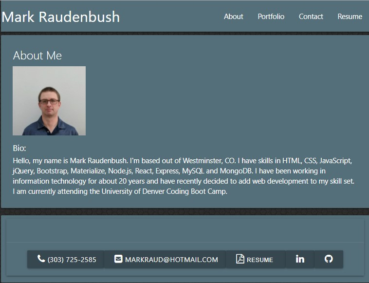

# Title: React Portfolio

## Descrption:

This is my portfolio build using React.

## Table of Contents:

- [Installation](#installation)

- [Usage](#usage)

- [License](#license)

- [Contributing](#contributing)

- [Tests](#tests)

- [Links](#links)

- [Questions](#questions)

## Installation

Access the website.

## Usage

The website opens with the "About" section. By clicking on the links in the navigation bar in the header you can change the content of the center card.

## License

This application is covered by the MIT license. Click the link for more information.

[https://opensource.org/licenses/MIT](https://opensource.org/licenses/MIT)

## Contributing

Mark Raudenbush

## Tests

Minimal testing performed.

## Links

[My GitHub](https://github.com/markraud)

[React Portfolio GitHub Repo](https://github.com/markraud/react_portfolio)

[Deployed React Portfolio](https://markraud.github.io/react_portfolio/)

## Questions

Please email with any questions.
[markraud@hotmail.com](mailto:markraud@hotmail.com)
